# Entregables: DonaTrack (Entrega 1)

> [!NOTE]
> Este documento contiene los diagramas y justificaciones de diseño solicitados en el enunciado de la Entrega 1.

## 1. Justificaciones de Diseño

*   **Polimorfismo en Donantes:** Se implementó una clase base abstracta `Donante` con las especializaciones `PersonaHumana` y `PersonaJuridica`. Esto nos permite tratar a todos los donantes de manera uniforme (por ejemplo, al registrar una donación) sin necesidad de usar lógicas condicionales o casteos excesivos.
*   **Patrón Strategy (Medios de Contacto y Notificaciones):** Dado que se requiere enviar notificaciones por distintos medios (Mail, SMS, WhatsApp) y que esto interactuará con servicios externos en el futuro, se encapsuló la lógica de envío detrás de la interfaz `Notificador`. La clase `MedioDeContacto` actúa como contexto y delega el envío a la estrategia concreta inyectada, asegurando alta cohesión y bajo acoplamiento (Principio Open/Closed de SOLID: es fácil agregar un `NotificadorTelegram` en el futuro sin tocar el resto del código).
*   **Segmentación de Donaciones:** Para evitar la modificación de la donación original, el sistema recibe una `DonacionGeneral` con la totalidad de los bienes. El componente `SegmentadorDonaciones` es el responsable de aplicar la lógica de negocio para dividir esta carga en múltiples instancias de `DonacionSegmentada`, agrupando los bienes obligatoriamente por `Subcategoria`, `esUsado` y `fechaVencimiento`. 
*   **Patrón State (Estados de la Donación):** El ciclo de vida de una donación segmentada (`EnDeposito`, `AsignacionRealizada`, etc.) tiene reglas estrictas sobre qué transiciones son válidas (ej. no se puede confirmar entrega si no está en traslado). Usando el patrón State, cada estado es una clase que hereda de `EstadoDonacion` y define únicamente las transiciones permitidas, delegando el cambio de estado al contexto (`DonacionSegmentada`). Esto elimina las complejas estructuras `if/switch` y facilita agregar nuevos estados si el proceso logístico muta.
*   **Polimorfismo en Necesidades:** La forma en la que una `Necesidad` determina si está "satisfecha" difiere diametralmente entre una recurrente y una extraordinaria. Se implementó una clase abstracta `Necesidad` con el método abstracto `estaSatisfecha()`, el cual es resuelto por `NecesidadRecurrente` y `NecesidadExtraordinaria` utilizando "Late Binding" (ligadura dinámica).

## 2. Diagrama de Clases (Modelo de Dominio)

```mermaid
classDiagram

    %% Donantes
    class Donante {
        <<abstract>>
        -List~MedioDeContacto~ mediosDeContacto
        -MedioDeContacto predeterminado
        +agregarMedioDeContacto(MedioDeContacto)
        +notificar(String)
    }

    class PersonaHumana {
        -String nombre
        -String apellido
        -String documento
        -String genero
    }

    class PersonaJuridica {
        -String razonSocial
        -TipoOrganizacion tipo
        -String cuit
        -List~Representante~ representantes
        +agregarRepresentante(Representante)
    }

    class Representante {
        -String nombre
        -String apellido
        -List~MedioDeContacto~ mediosDeContacto
    }

    Donante <|-- PersonaHumana
    Donante <|-- PersonaJuridica
    PersonaJuridica "1" *-- "*" Representante : tiene

    %% Notificaciones
    class MedioDeContacto {
        -String valor
        +notificar(String)
    }
    
    class Notificador {
        <<interface>>
        +enviar(String, String)
    }

    Donante "1" *-- "*" MedioDeContacto
    MedioDeContacto "1" o-- "1" Notificador : strategy

    class NotificadorMail {
        +enviar(String, String)
    }
    class NotificadorSMS {
        +enviar(String, String)
    }
    class NotificadorWhatsApp {
        +enviar(String, String)
    }

    Notificador <|.. NotificadorMail
    Notificador <|.. NotificadorSMS
    Notificador <|.. NotificadorWhatsApp

    %% Donaciones
    class DonacionGeneral {
        -LocalDate fechaRegistro
        -String descripcionGeneral
        -List~Bien~ bienes
    }

    class DonacionSegmentada {
        -Boolean esUsado
        -LocalDate fechaVencimiento
        -List~Bien~ bienes
        +cambiarEstado(EstadoDonacion)
        +asignar()
        +iniciarTraslado()
        +confirmarEntrega()
    }

    class Bien {
        -String descripcion
        -double cantidad
        -String unidadMedida
        -Boolean esUsado
        -LocalDate fechaVencimiento
    }

    class Categoria {
        -String nombre
        -boolean requiereEstadoUsadoNuevo
    }

    class Subcategoria {
        -String nombre
    }

    DonacionGeneral "1" *-- "*" Bien
    DonacionSegmentada "1" *-- "*" Bien
    Donante "1" -- "*" DonacionGeneral : registra
    DonacionSegmentada "*" -- "1" Subcategoria : clasifica
    Bien "*" -- "1" Subcategoria : pertenece
    Categoria "1" *-- "*" Subcategoria : contiene

    class SegmentadorDonaciones {
        +segmentar(DonacionGeneral): List~DonacionSegmentada~
    }

    %% Estados Donacion (State)
    class EstadoDonacion {
        <<abstract>>
        +asignar()
        +planificarRuta()
        +iniciarTraslado()
        +confirmarEntrega()
        +fallarEntrega(String)
        +vencer()
    }

    DonacionSegmentada "1" *-- "1" EstadoDonacion : estado actual

    class EnDeposito
    class AsignacionRealizada
    class ListaParaEntregar
    class EnTraslado
    class Entregada
    class EntregaFallida
    class Vencida

    EstadoDonacion <|-- EnDeposito
    EstadoDonacion <|-- AsignacionRealizada
    EstadoDonacion <|-- ListaParaEntregar
    EstadoDonacion <|-- EnTraslado
    EstadoDonacion <|-- Entregada
    EstadoDonacion <|-- EntregaFallida
    EstadoDonacion <|-- Vencida

    %% Entidades y Necesidades
    class EntidadBeneficiaria {
        -String razonSocial
        -String direccion
        -List~Representante~ representantes
        -List~Necesidad~ necesidades
        +registrarNecesidad(Necesidad)
    }

    class Necesidad {
        <<abstract>>
        -String descripcion
        -double cantidadObjetivo
        -List~DonacionSegmentada~ donacionesRecibidas
        +recibirDonacion(DonacionSegmentada)
        +estaSatisfecha() bool
    }

    class NecesidadExtraordinaria {
        +estaSatisfecha() bool
    }

    class NecesidadRecurrente {
        -String periodo
        +estaSatisfecha() bool
    }

    EntidadBeneficiaria "1" *-- "*" Necesidad
    Necesidad <|-- NecesidadExtraordinaria
    Necesidad <|-- NecesidadRecurrente
    Necesidad "*" -- "1" Subcategoria : requiere
    Necesidad "1" o-- "*" DonacionSegmentada : recibe
```

